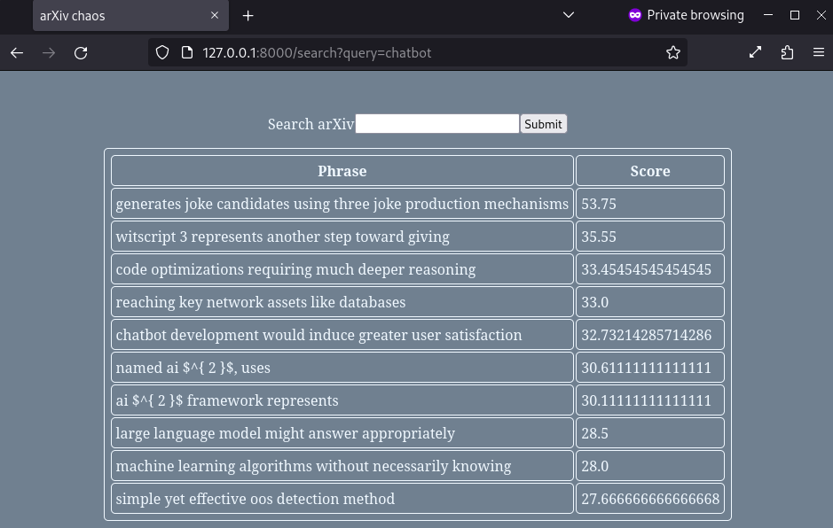

# arXiv Chaos!
Science make too much sense? Worry not! With `arxiv-chaos` you can confuse yourself even more!

`arxiv-chaos` extracts key phrases from [arXiv](https://arxiv.org) article abstracts for a given search query via an implementation of the Rapid Automatic Keyword Extraction (RAKE) algorithm.

A CLI program and a web server are provided.


## Installation
This was developed with python version `3.11`, but `3.10+` should be sufficient for the type annotation features used.

Create a virtual environment
`python -m venv venv`

Activate the virtual environment
`. venv/bin/activate`

Install pip requirements
`pip install -r requirements.txt`

I also had to install some `nltk` dependencies via the following (note: this will download files outside of the python environment):
```python
>>> import nltk
>>> nltk.download('stopwords')
>>> nltk.download('punkt')
```


## Running the CLI
After installing the dependencies, the CLI can be run with
`./arxiv_chaos_cli [QUERY]`


## Running the web server
After installing the dependencies, the web server can be run with
`./run_server`

The server runs on `127.0.0.1:8000`

This can be accessed in a web browser or via `curl` with
`curl 127.0.0.1:8000/search?query=<QUERY>`


